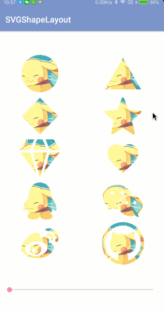
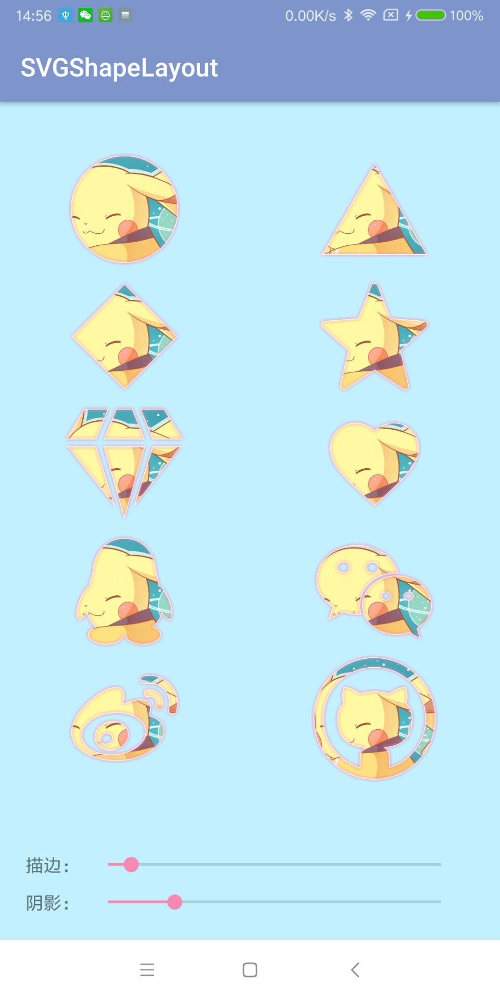

### Gradle引入
```
implementation 'com.dyhdyh.view:svg-shape-layout:1.0.1-beta'
```

### 将SVG转成Vector XML


### 在XML使用
```
<com.dyhdyh.view.SVGShapeLayout
    android:id="@+id/svg_layout"
    android:layout_width="100dp"
    android:layout_height="100dp"
    app:strokeWidth="5dp"
    app:svg="@drawable/ic_love"
    app:strokeColor="@color/colorAccent">

    <ImageView
        android:layout_width="match_parent"
        android:layout_height="match_parent"
        android:src="@drawable/test" />
        
</com.dyhdyh.view.SVGShapeLayout>
```

### 在Java中使用
```
svgLayout.setSVGResources(R.drawable.ic_qq);
svgLayout.setStrokeWidth(10);
svgLayout.setStrokeColor(Color.BLUE);
```

### 兼容Android 4.4及以下
将Vector XML放到`drawable-nodpi`

### 注意事项
某些`fillType`为`evenOdd`的SVG可能会出现`Resources$NotFoundException`，可以尝试把这个属性去掉