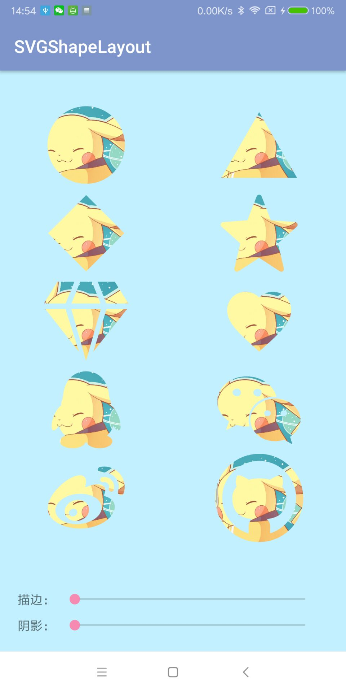
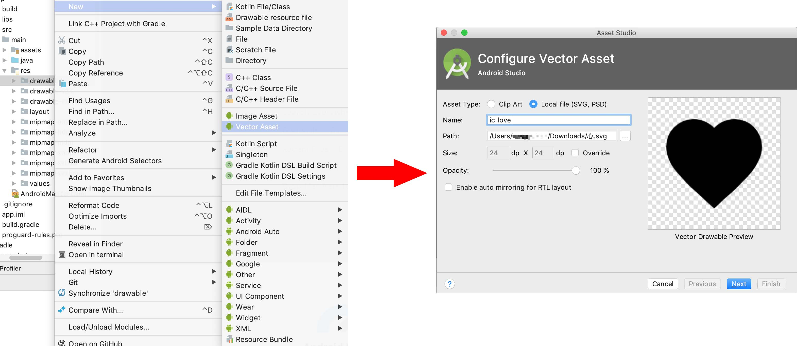

### Gradle引入
```
implementation 'com.dyhdyh.view:svg-shape-layout:1.0.2'
```

### 将SVG转成Vector XML


### 在XML使用
```
<com.dyhdyh.view.svgshape.SVGShapeLayout
    android:id="@+id/svg_layout"
    android:layout_width="100dp"
    android:layout_height="100dp"
    app:strokeWidth="5dp"
    app:svg="@drawable/ic_love"
    app:strokeColor="@color/colorAccent">

    <ImageView
        android:layout_width="match_parent"
        android:layout_height="match_parent"
        android:src="@drawable/test" />
        
</com.dyhdyh.view.svgshape.SVGShapeLayout>
```

或

```
<com.dyhdyh.view.svgshape.SVGShapeImageView
    app:strokeWidth="5dp"
    app:svg="@drawable/ic_love"
    app:strokeColor="@color/colorAccent"
    android:layout_width="100dp"
    android:layout_height="100dp" />
```

### 支持的属性
```
<!--vector-->
<attr name="svg" format="reference" />
<!--描边宽度-->
<attr name="strokeWidth" format="dimension|reference" />
<!--描边颜色-->
<attr name="strokeColor" format="color|reference" />
<!--阴影颜色-->
<attr name="shadowColor" format="color|reference" />
<!--阴影半径-->
<attr name="shadowRadius" format="dimension|reference" />
```

### 兼容Android 4.4及以下
将Vector XML放到`drawable-nodpi`

### 注意事项
某些`fillType`为`evenOdd`的SVG可能会出现`Resources$NotFoundException`，可以尝试把这个属性去掉